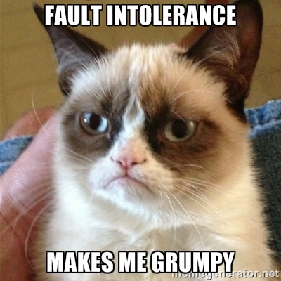

# Overview #

Demonstration of fault-injection techniques for a simple netcat-based application.

Please see [Introduction to Failure Testing with Docker](https://www.qualimente.com/2016/04/26/introduction-to-failure-testing-with-docker/) to learn how to perform failure testing with Docker and the faulty-cat demo application.

 